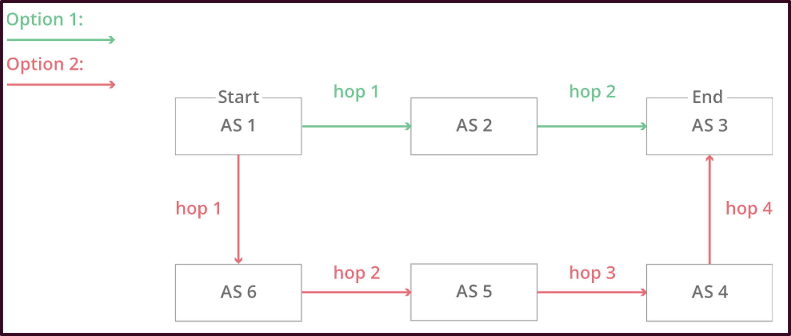

<!-- _footer: "[Download as a PDF](https://github.com/UniOfGreenwich/ELEE1157_Lectures/raw/gh-pages/content//c/Users/dev/Git/UoG/ELEE1157/Lectures/content/BGP/BGP.pdf)" -->

# Border Gateway Protocol

    Module Code: ELEE1157

    Module Name: Network Routing Management

    Lecturer: Seb Blair BEng(H) PGCAP MIET MIHEEM FHEA

---

## Contents

1. What is Border Gateway Protocol PT1
2. What is Border Gateway Protocol PT2
3. Autonomous System PT1
4. Autonomous System PT2
5. Autonomous System PT3
6. BGP Friend or Competitor?

7. Who Operates Autonomous Systems?
8. Autonomous System Number
9.  External and Internal Border Gateway Protocol
10. Breaking the Internet with Border Gateway Protocol
11. Trust

---

## Border Gateway Protocol

- Border Gateway Protocol (BGP) is the postal system of the internet. 

- When a packet leaves your system to another system over the Internet, **BGP** is responsible for looking at all of the available paths that the outbound packet/data could travel, and picking the best route, which usually hopping between **Autonomous Systems**.

  - When you post a letter into a post box, the Royal Mail for example will process that piece of mail and will choose a fast, efficient route to deliver that item to its addresses recipient. 

---

## Autonomous Systems

So far we have looked at LANs and WANs, but the internet is made of billions and billions of network. To manage the size of the internet these billions of networks are broken up into hundreds of thousands of smaller networks, known as **Autonomous Systems (AS)**. So each of these networks is essentially a large pool of routers run by a single organisation. 

The Internet therefore is a network of networks

---

## Border Gateway Protocol

So essentially, the BGP is the protocol that makes the Internet work by enabling data routing on the Internet.

- When a user in **Australia** loads a website with **origin servers** in **Canada**, BGP is the protocol that enables that communication to happen quickly and efficiently.

Static content such as 
images and files can
 be cached on edge server

When a login request is made 
dynamic data is requested so this
is stored on the origin server 

---

## Autonomous Systems

If we continue to think of BGP as a postal service of the Internet then the AS’s are like individual post office branches.

A town may have hundreds of mailboxes, 
but the mail in those boxes must go through 
the local postal office before being routed to another destination. 

The internal routers within an AS are like 
post boxes, they forward their outbound
transmissions to the AS, which then uses 
BGP routing to get these transmissions to their destinations.

---

## Autonomous Systems

The figure below illustrates a simplified version of BGP.  In this version there are only six autonomous systems on the Internet. If **AS1** needs to route a packet to **AS3**, it has two different options:

AS2 → AS3

AS6 → AS5 → AS4 → AS3

Now imagine that there are hundreds of thousands of AS’s and that hop count is only one part of a complex route selection algorithm. That’s the reality of BGP routing on the Internet.

---

## BGP Friend or Competitor

- **AS** must be kept up to date with information regarding **new** routes as well as **obsolete** routes.

- This is done through **peering sessions** where each **AS** connects to **neighbouring AS’s** for the purpose of **sharing routing information**. 

- Using this information, each **AS** is equipped to properly route outbound data transmissions coming from within.

- BGP routes sometimes take **business considerations** into account. 

- **Autonomous Systems** often **charge** each other to carry **traffic** across **their networks**, and the price of access can be factored into which route is ultimately selected.

---

## Who operates BGP Autonomous Systems?

Autonomous Systems (AS) typically belong to **Internet Service Providers** (ISP) or other large high-tech organisations:

- Tech Companies

- Universities

- Government agencies

- and Scientific organisation

Each AS wishing to exchange routing information must have a registered **Autonomous System Number (ASN)**

---

## Autonomous System number

**Internet Assigned Numbers Authority (IANA)** assigns ASNs to **Regional Internet Registries** (RIRs), which then assigns them to **ISP**s and networks.  

ASNs are:
- 16 bit numbers between 1 and 65534

- 32 bit numbers between 131072 and 4294967294. 

In of 2020, there were approximately 67,000 ASNs in-use worldwide. Now there are 110,000+  These ASNs are only required for external BGP.

---

## External and Internal BGP

- Routes are exchanged and traffic is transmitted over the Internet using **external** BGP or **eBGP**.

- **AS** can route through their internal networks, which is known as **internal BGP**, or **iBG**.

- AS can choose from a number of internal protocols to connect the routers on their internal network.

- **eBGP** is like international shipping; there are certain standards and guidelines that need to be followed when shipping a piece of mail internationally.

---

## BGP Hijacking

---

##  Trust

- BGP hijacks happen because the route-sharing function of BGP relies on trust through which the AS implicitly trust the routes that are shared with them.

- There have been proposals to remedy this, but it would every AS to simultaneously update their behaviour.  Which would the require the coordination of hundreds of thousands of organisations and the temporary downtime of the entire Internet.
