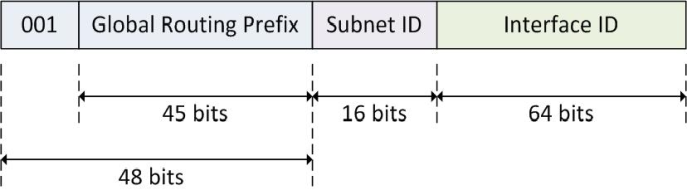
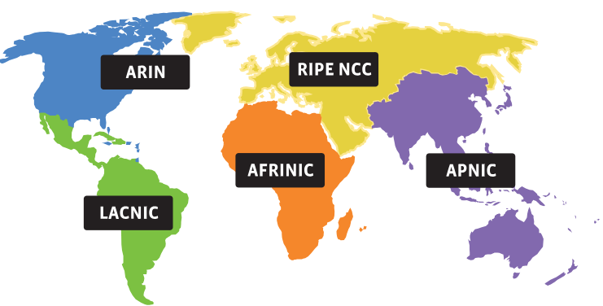
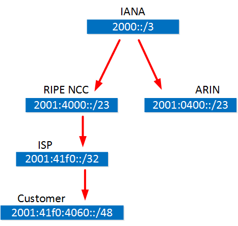
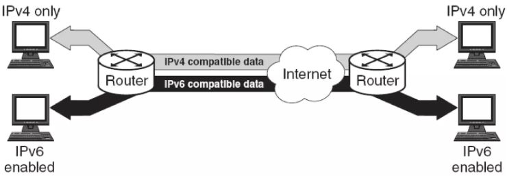
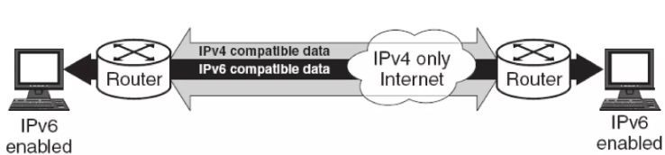
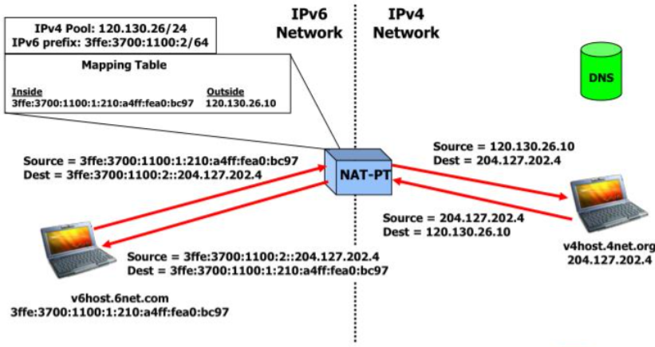
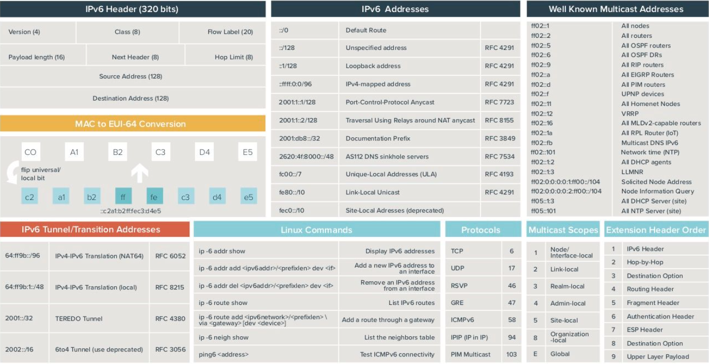

<!-- _footer: ""-->

# IPStructure

    Module Code: ELEE1157

    Module Name: Network Routing Management

    Credits: 15

    Module Leader: Seb Blair BEng(H) MPhil PGCAP MIET MIHEEM FHEA

---

## What is IPv4?

- **IPv4**: Internet Protocol version 4 is a core protocol that defines IP addresses used in networking.
- **32-bit** address space, supporting up to **4.3 billion addresses**.

---

## IPv4 Address Structure

- IPv4 addresses are written as four **octets** separated by periods.
- Example: `192.168.1.1`
- Each octet is an **8-bit binary number** (total 32 bits).

  ```plaintext
  IPv4 Address Example: 11000000.10101000.00000001.00000001
  ```
- Each octet ranges from `0-255` in decimal.

---

## IPv4 Address Classes

IPv4 addresses are divided into five classes:

<div align=center>

| Class | Range                       | Usage           |Networks|Hosts|
|-------|-----------------------------|-----------------|--------|-----|
| A     | 1.0.0.0 - 126.0.0.0         | Large networks  |16777216|16777214|
| B     | 128.0.0.0 - 191.255.0.0     | Medium networks |65534|65534|
| C     | 192.0.0.0 - 223.255.255.0   | Small networks  |2097152|254|
| D     | 224.0.0.0 - 239.255.255.255 | Multicasting    |||
| E     | 240.0.0.0 - 255.255.255.255 | Experimental    |||

</div>

---

## Reserved IP Ranges

IPv4 has reserved addresses for private networks and special purposes.

<div align=center>

| Range               | Description            |
|---------------------|------------------------|
| 10.0.0.0 - 10.255.255.255 | Class A private |
| 172.16.0.0 - 172.31.255.255 | Class B private |
| 192.168.0.0 - 192.168.255.255 | Class C private |
| 127.0.0.0 - 127.255.255.255 | Loopback (localhost) |

</div>

---

## Subnetting in IPv4

### What is Subnetting?
- Dividing a large network into smaller, manageable subnetworks.
- Uses a **subnet mask** to identify network and host portions.

### Example:
- IP: `192.168.1.0/24`
- Subnet Mask: `255.255.255.0`

  ```plaintext
  Network Portion | Host Portion
  192.168.1       | .0 - .255
  ```

---

## CIDR Notation

### CIDR (Classless Inter-Domain Routing)
- Uses `slash` notation to indicate the subnet mask length (e.g., `/24`).
- `192.168.1.0/24` means the first 24 bits are network bits.

### Examples of CIDR:
- `/8` (Class A) -> 255.0.0.0
- `/16` (Class B) -> 255.255.0.0
- `/24` (Class C) -> 255.255.255.0

---

## Example: Calculating Subnets P1

<div style="font-size:"24px">

**Given Network:** whose IP is range is `192.168.1.0/24` create four subnets.

|1. To create four subnets, we need to borrow bits from the host portion
   - **Subnet Mask**:
      -  `/26` -> 255.255.255.192 or `11111111.11111111.11111111.11000000`

2. Calculate Number of Subnets and Hosts per Subnet:
    - With `/26`, the first 26 bits are the network portion, and the remaining 6 bits are for hosts.
    - Number of subnets created: $2^2 = 4$ (since we borrowed two bits)
    - Hosts per subnet: $2^6 = 64 $ addresses per subnet (62 usable)

</div>

---
## Example: Calculating Subnets P2

3. **Determine the Subnet Ranges:**:

 - Starting with 192.168.1.0, each subnet has 64 addresses, incrementing by 64 for each subsequent subnet.

<div align=center>

|Subnet ID|	Range|	Description|
|---|---|---|
|`192.168.1.0/26 `  |	`192.168.1.0`   - `192.168.1.63`	  | First subnet
|`192.168.1.64/26`  |	`192.168.1.64`  - `192.168.1.127`	| Second subnet
|`192.168.1.128/26` |	`192.168.1.128` - `192.168.1.191` |	Third subnet
|`192.168.1.192/26`	| `192.168.1.192` - `192.168.1.255`	| Fourth subnet

</div>

---


## Why IPv6?

**IPv4 Address Exhaustion**

- IPv4: 32-bit address space (~4.3 billion addresses).

- Increasing number of internet-connected devices.

- IPv6: 128-bit address space

- ~340 undecillion addresses (enough for future needs).

**Enhanced features:**

- Auto-configuration.

- Improved security (IPSec).

- Simplified header format.

---

## IPv6 Address Format

<div align=center>



</div>

<div style="font-size:22px">

- Length: 128 bits (8 groups of 16 bits each).

- Hexadecimal notation.

- Groups separated by colons (e.g., 2001:0db8:85a3:0000:0000:8a2e:0370:7334).

**Simplification Rules:**

- Remove leading zeros (e.g., 0010 -> 10).

- Replace consecutive zero groups with :: (only once per address).

</div>

---

## Anatomy of IPv6 address format: Example

<div align=center>


</div>

---

<div align=center>





</div>

<!--

Internet Assigned Numbers Authority


-->
---

## IPv4 to IPv6 Transition

<div style="font-size:22px">

- **Dual Stack**

  - Devices run both IPv4 and IPv6 simultaneously.

  - Allows gradual transition.

<div align=center>



</div>

---

<div style="font-size="24px">

- **Tunneling**

  - Encapsulates IPv6 packets within IPv4 headers.

  - **Examples:**

    - 6to4: Automatically assigns an IPv6 prefix to IPv4.

    - Teredo: Tunnels IPv6 over IPv4 using NAT.

<div align=center>



</div>

---

<div style="font-size="24px">

- **Translation**

  - **NAT64:**

    - Maps IPv6 addresses to IPv4 and vice versa.

    - Enables IPv6-only devices to communicate with IPv4 devices.

</div>

<div align=center>




</div>

---

##  IPv4 to IPv6

### Step 1: Understand the IPv4 Address
- Example IPv4: `192.168.0.1`
- Convert to binary:
  - 192 -> `11000000`
  - 168 -> `10101000`
  - 0 -> `00000000`
  - 1 -> `00000001`
- Binary IPv4: `11000000.10101000.00000000.00000001`


---


### Step 2: Map IPv4 to IPv6 Format
- IPv6 has special prefixes for IPv4-mapped addresses:
  - `::ffff:0:0/96`
- Append the 32-bit binary IPv4 to the `::ffff:` prefix.

---

### Step 3: Convert Binary IPv4 to Hexadecimal

<div style="font-size:23px">

- IPv4 in binary: `11000000.10101000.00000000.00000001`
- Group into 4-bit chunks:
  - `1100 0000 1010 1000 0000 0000 0000 0001`
- Convert each chunk to hexadecimal:
  - `1100` -> `C`
  - `0000` -> `0`
  - `1010` -> `A`
  - `1000` -> `8`
  - `0000` -> `0`
  - `0000` -> `0`
  - `0000` -> `0`
  - `0001` -> `1`
- Hexadecimal IPv4: `C0:A8:00:01`

</div>

---

### Step 4: Construct the IPv6 Address
- Prefix: `::ffff:`
- Hexadecimal IPv4: `C0:A8:00:01`
- Combined: `::ffff:C0A8:01`

---

## Examples for Practice

### Example 1
Convert the IPv4 address `10.0.0.1` to IPv6.

<details>
<summary>Solution</summary>

1. Binary conversion:
   - 10 -> `00001010`, 0 -> `00000000`,  0 -> `00000000` ,  1 -> `00000001`
   - Binary: `00001010.00000000.00000000.00000001`
2. Hexadecimal conversion:
   - `0000 1010 0000 0000 0000 0000 0000 0001`
   - Hexadecimal: `A:0:0:1`
3. IPv6 address: `::ffff:A:0:0:1`

</details>

---

### Example 2
Convert the IPv4 address `172.16.254.1` to IPv6.

<details>
<summary>Solution</summary>

1. Binary conversion:
   - 172 -> `10101100`, 16 -> `00010000`,    - 254 -> `11111110`, 1 -> `00000001`
   - Binary: `10101100.00010000.11111110.00000001`
2. Hexadecimal conversion:
   - `1010 1100 0001 0000 1111 1110 0000 0001`
   - Hexadecimal: `AC:10:FE:01`
3. IPv6 address: `::ffff:AC10:FE01`

</div>

---

## Cheat Sheet

<div align=center>



</div>

---

## Summary

- IPv4 is a 32-bit address space with classes for different network sizes.
- Subnetting divides a network into smaller parts using subnet masks.
- IPv6 due to exhaustion of IPv4 address spaces
- CIDR provides flexible subnetting options.
