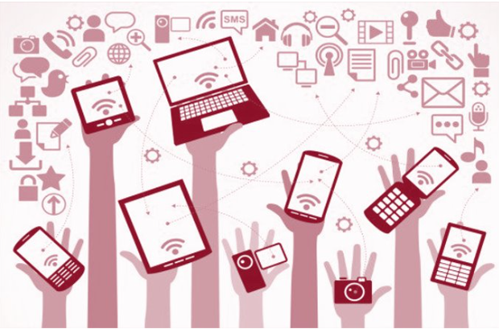
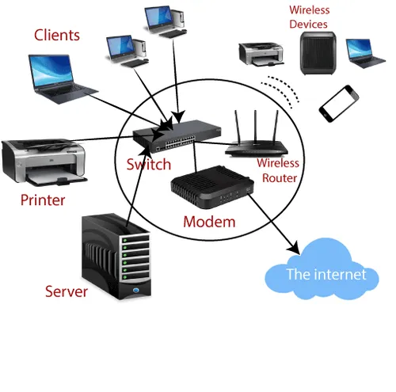
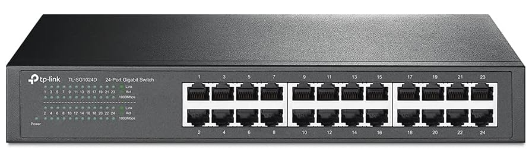
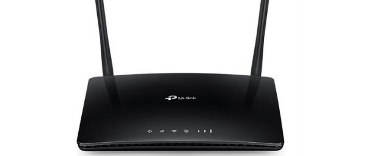
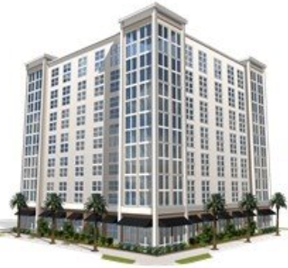
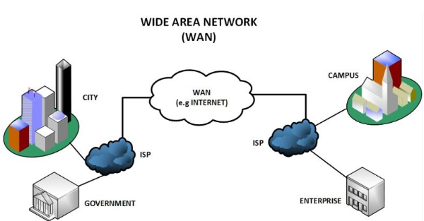

<!-- _footer: "[Download as a PDF](https://github.com/UniOfGreenwich/ELEE1157_Lectures/raw/gh-pages/content/IntroToNetworking/IntroToNetworking.pdf)" -->

# Introduction To Networking

    Module Code: ELEE1157

    Module Name: Network Routing Management

    Credits: 15

    Module Leader: Seb Blair BEng(H) PGCAP MIET MIHEEM FHEA

---

 

## What is  A COMPUTER NETWORK?​

Computer networking refers to connected computing devices (such as laptops, desktops, servers, smartphones, and tablets) and an ever-expanding array of IoT devices (such as cameras, door locks, doorbells, refrigerators, audio/visual systems, thermostats, and various sensors) that communicate with one another.​

---

## Examples of CNs 

- Networks are collections of computers, software, and hardware that are all connected to help their users work together. ​

- A network connects computers by means of  Wired systems or Wireless connectivity, specialised software, and devices that manage data traffic. ​

- A network enables users to share files and resources, such as printers, as well as send messages electronically (e-mail) to each other.​

---

## Specialised devices 1​

Specialised devices such as **switches**, **routers**, and **access points** form the foundation of computer networks​

- ​Switches​

  - Switches connect and help to **internally secure** computers, printers, servers, and other devices to networks in homes or organisations​

- Access Points​

  - Access points are switches that connect devices to networks without the use of cables​

- Switches/Access Points identify a connected computer by its Media Access Control (MAC) address.  ​

  - MAC 12-digit hexadecimal numbers (48 bits in length) – MM:MM:MM:SS:SS:SS​

    - 00:0a:95:9d:68:16  this is the Network Interface Card (NIC)​

---

## Specialised devices 2​ - Routers

 
- Connect networks to other networks and act as dispatchers. ​

  - They **analyse data** to be sent across a network, choose the **best routes** for it, and send it on its way. ​

  - **Connect** your **home** and **business** to the **world** and help **protect** information from outside **security threats​**

- Identify a connected computer by is network assigned​Internet Protocol (IP) address. ​

  - IPv4 addresses are usually represented in dot-decimal notation, ​consisting of four decimal numbers, each ranging from 0 to 255 ​
​
    - xxx.xxx.xxx.xxx -> 192.168.1.0​

---

## Types of computer networks 1

While similar in their overall objectives, various types of networks fulfil different purposes.​

Here are two:​

 - LAN​
 - WAN​

---

## Types of computer networks 2​

**LAN**

- is a collection of connected devices in one physical location, such as a home or an office. ​

- can be small or large, ranging from a home network with one user to a large enterprise network with thousands of users and devices, with a limited area.  

- may include both wired and wireless devices.​

---

## Types of computer networks 3​

**WAN**
- extends over a large geographical area and connects individual users or multiple LANs, the Internet $\therefore$ can be considered a WAN. ​

- large organisations use WANs to connect their various sites, remote employees, suppliers, and data centres so they can run applications and access necessary data.​

- physical connectivity in WANs can be achieved by leased lines, cellular connections, satellite links, and other means.​

