<!-- _footer: "[Download as a PDF](https://github.com/UniOfGreenwich/ELEE1157_Lectures/raw/gh-pages/content//c/Users/dev/Git/UoG/ELEE1157/Lectures/content/OSI/OSI.pdf)" -->

# OSI

    Module Code: ELEE1157

    Module Name: Network Routing Management

    Lecturer: Seb Blair BEng(H) PGCAP MIET MIHEEM FHEA

---

## Contents

1. What is the Open Systems Interconnection Model
2. The Seven Layers of OSI
3. OSI Layers – Physical
4. OSI Layers – Data Link
5. OSI Layers – Network Link
6. OSI Layers – Transport Link
7. OSI Layers – Session Link
8. OSI Layers – Presentation Link

9. OSI Layers – Application Link
10. Advantages of the OSI Model
11. Advantages of the OSI Model 2
12. OSI in Action Example
13. OSI in Action Example 2

---

## What is the Open Systems Interconnection Model

- The Open Systems Interconnection (OSI) model describes seven layers that computer systems use to communicate over a network.

- Introduce in 1983 by US DoD and adopted by the ISO standards in 1984

- It is older than the more TCP/IP which is what the modern internet is based on due to its simpler model. 

---

## The seven layers of OSI

**Mnemonics**

**Top to bottom**
- All Pros Search Top Notch Donut Places
- All People Seem To Need Data Processing
- All People Should Try New Dr Pepper
- A Priest Slapped The Nun During Prayer

**Bottom to Top**
- Please Do Not Throw Sausage Pizza Away
- Please Do Not Touch Sally's Pretty Ass
- Please Do Not Touch Steve's Pet Alligator

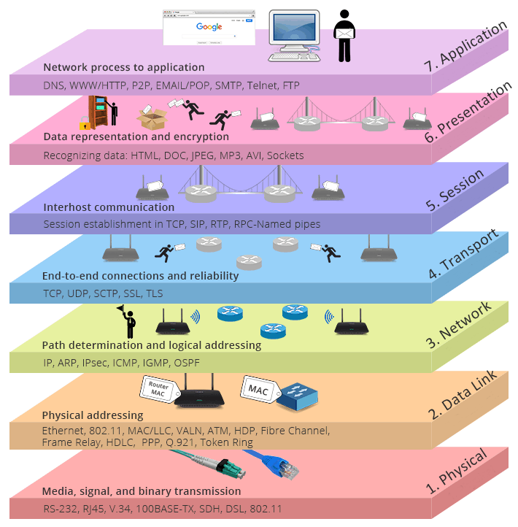

---

## Description of the OSI layers - Physical

- physical cable between network nodes

- wireless connection between network nodes 

- connector, the 

- electrical cable or 

- wireless technology 

- transmission of the raw data packets 0s and 1s,

- Control of bit rate

- Electrons, RF or Light

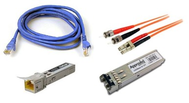

---

## Description of the OSI layers - Data Link

- Establishes and terminates a connections 

- Frames 

- Logical Link Control (LLC), which identifies network protocols, performs error checking and - synchronizes frames

- Media Access Control (MAC) which uses MAC addresses to connect devices and define permissions to transmit and receive data.

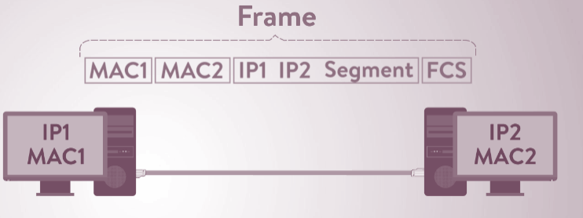

---

## Description of the OSI layers - Network Layer

- Handles the routing of data

- Each frame of data is examined to conclude if the data has reached its ultimate target. 

- Sends data to the correct destination on transmitted and received transmissions 

- The IP portion of TCP/IP is the commonly known network layer for the Internet.

- Manages the mapping between logical addresses and physical addresses, for IP addresses, this is accomplished through Address Resolution Protocol or ARP

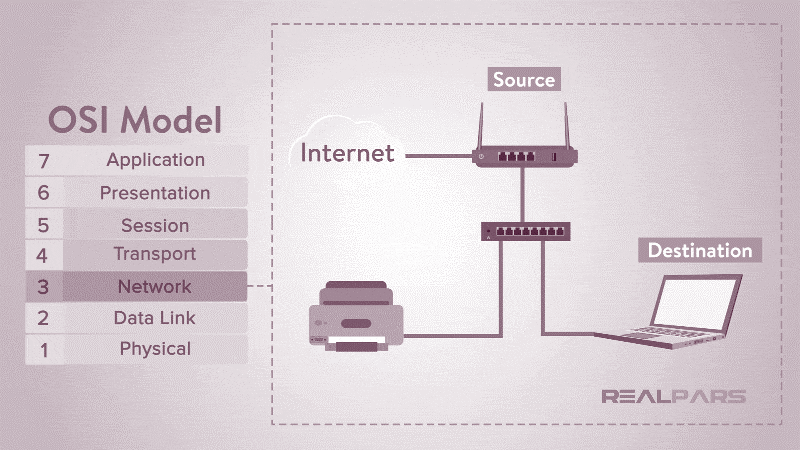

---

## Description of the OSI layers - Transport Layer

- Transmission of data across network connections

- Coordinates how much data to send, how fast, where it goes, and these sort of things. 

- Services may be provided by “Transmission Control Protocol” or TCP and “User Datagram Protocol” or UDP.  Other protocols may provide additional capabilities including error recovery, data flow, and retransmission.

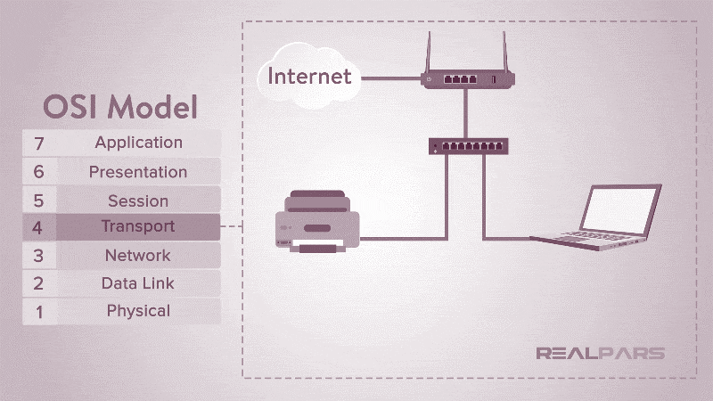

---

## Description of the OSI layers - Session Layer

- At the Session layer, or layer 5, the construction, direction, and conclusion of connections between devices occur. 

- This layer supports multiple types of connections as well as being responsible for authentication and reconnection if a network interruption should occur.

- After the session is established the data then passes to or from the Transport layer

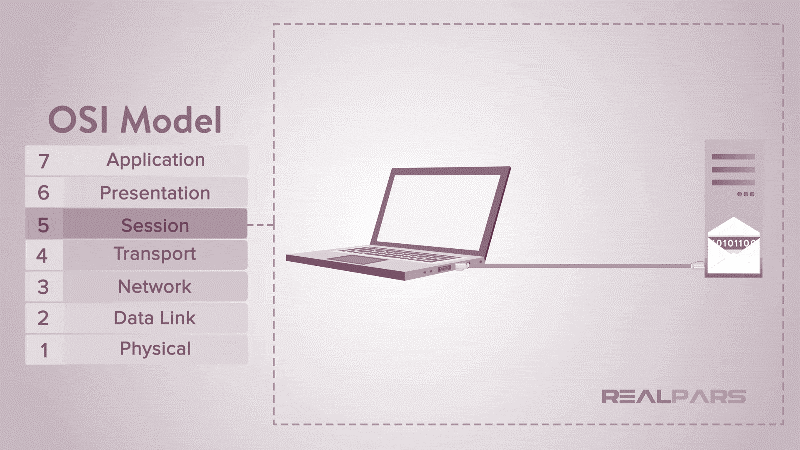

---

## Description of the OSI layers - Presentation Layer

- Syntax processing or converting data from one format to another.

- This layer handles translating the data from the top layer, which is presented in application format, to network format and vice versa.

- After the Presentation layer processes the data from one format to another, the information is then passed to the Session layer or the Application layer depending on whether the data is transmitting or receiving

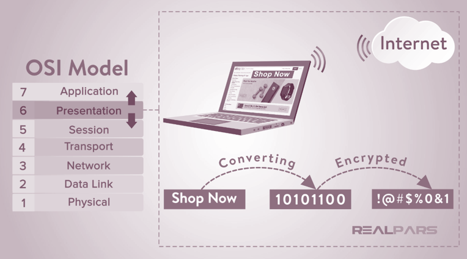

---

## Advantages of OSI model

**The OSI model helps users and operators of computer networks:**

- Determine the required hardware and software to build their network

- Understand and communicate the process followed by components communicating across a network

- Perform troubleshooting, by identifying which network layer is causing an issue and focusing efforts on that layer

---

## Advantages of OSI model

**The OSI model helps network device manufacturers and networking software vendors:**

- Create devices and software that can communicate with products from any other vendor, allowing open interoperability

- Define which parts of the network their products should work with.

- Communicate to users at which network layers their product operates – for example, only at the application layer, or across the stack.

---

## OSI in action example 1

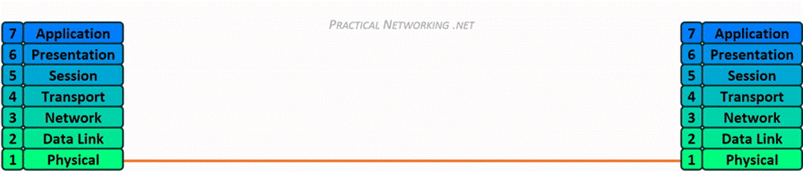

---

## OSI in action example 2

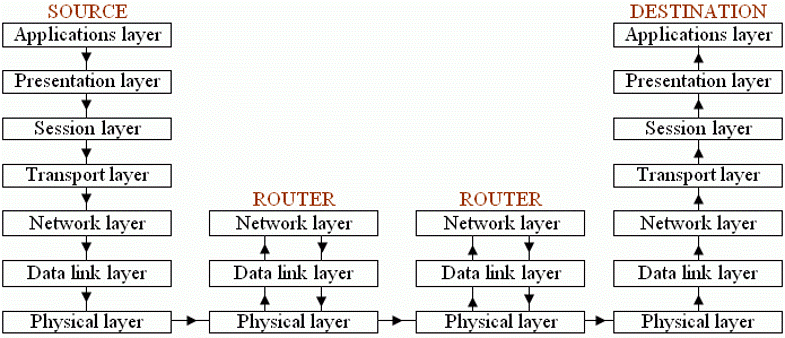

---

## TCP/IP 4 Layer stack model

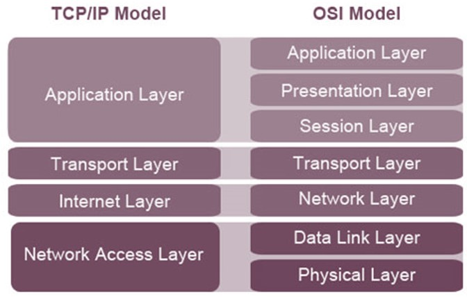

---

## Operation Examples using both models

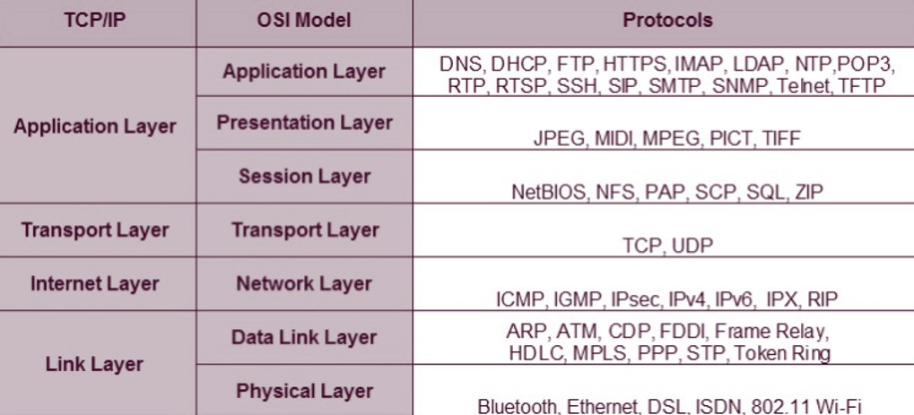