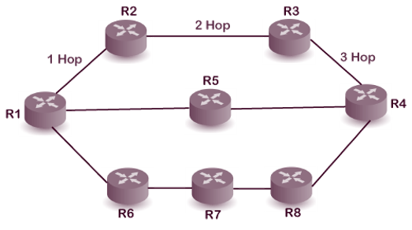
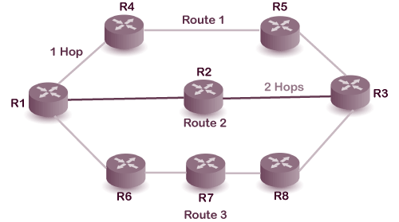

<!-- _footer: "[Download as a PDF](https://github.com/UniOfGreenwich/ELEE1157_Lectures/raw/gh-pages/content//g/Documents/GitHub/ELEE1157/Lectures/content/RIP/RIP.pdf)" -->

# RIP

    Module Code: ELEE1157

    Module Name: Network Routing Management

    Lecturer: Seb Blair BEng(H) PGCAP MIET MIHEEM FHEA

---

## Contents

1. Intended Learning Outcomes​

2. User Datagram Protocol​

3. RIP Message Format​

4. RIP Message Format Size Calculation​

5. RIP Scenario​

6. Routing Information Protocol​

7. RIP Routing Tables: Layout​

8. RIP Routing Tables: Timings​

9. RIP Part 2​

10. RIP Examples​

11. RIP Examples (Load Balancing)​

12. RIP Examples 3​

---

## User Datagram Protocol​

User Datagram Protocol (**UPD**) transmits data across the internet/network quickly because it transmits before communications is formally established.​

- **UDP**  is a standardised method for transferring data between to computers in network the number of routers that need to be passed to reach a destination IP network.​

- it sends **packets** (units of data transmission) directly to a target computer, without establishing a connection first, indicating the order of said packets, or checking whether they arrived as intended. ​

- UDP is faster but less reliable than TCP (Transmission Control Protocol). ​

- In a TCP communication, the two computers begin by establishing a connection via an automated process called a **‘handshake**.’ Only once this handshake has been completed will one computer actually transfer data packets to the other.​

---

## Routing information protocol

- RIP has been around since the late 1980s, 1988, was developed by Charles Hendrick. 

- RIP is based on the **distance vector-based** strategy data using broadcast **UDP**, so we consider the entire structure as a graph where **nodes** are the **routers**, and the **links** are the **networks**. and sends

**Routing metric**

- **Hop Count** is the number of routers that need to be passed to reach a destination IP network.

$$
\begin{equation}
    h_a = \lim_{i \rightarrow 16 } = 
    \begin{cases}
        1, & h_t < 16 \Leftarrow (h_t = h_t + i) \\
        0, & h_t == 16
    \end{cases}
\end{equation}
$$

Where $h_t$ is the total hops, 𝑖 is the next hop.

So a $h_t$ of 0 denotes a network that is directly connected to the router and 16 or more denotes an unreachable network, this is termed as infinity.

---

## RIP Message Format

- **Command**: It is an 8-bit field that is used for request or reply. The value of the request is 1, and the value of the reply is 2.

- **Version**: Here, version means that which version of the protocol we are using. Suppose we are using the protocol of version1, then we put the 1 in this field.

- **Reserved**: This is a reserved field, so it is filled with zeroes.

- **Family**: Is a 16-bit field.  If you are using TCP/IP family, you would put a 2 in this field.

- **Network Address**: It is defined as 14 bytes field. If we use the IPv4 version, then we use 4 bytes, and the other 10 bytes are all zeroes.

- **Distance**: The distance field specifies the hop count, i.e., the number of hops used to reach the destination.

--- 

## RIP Message Format Size Calculation

- Each message contains a **command** and a **version** number and can contain entries for up to **25 routes**.

- Each route entry includes an address **family identifier**, the **IP address** reachable by the route, and the **hop count** for the **route**. 

- Can contain a maximum of 25 route entries, $R_T$, per message. 

- If a router must send an update with more than 25 entries, multiple RIP messages must be produced. 

- Note that the initial portion,  $i_m$, of the message is four octets, and each route entry, $𝑅_L$, is 20 octets. 

- Therefore the maximum message size $M_𝑆$, is

$516\ 𝐵\ =\ (\ 4𝐵\ +\ [\ 20𝐵\ ∗\ 25𝐵\ ]\ )\ +\ 8𝐵\ +\ 4𝐵$

$𝑀_𝑠\ =\ (\ 𝑖_𝑚\ +\ [\ 𝑅_𝐿\ ∗\ 𝑅_𝑇\ ]\ )\ +\ 𝑈𝐷𝑃\ +\ 𝐼𝑃$

---

## RIP Scenario

**Scenario**

You have been tasked to write a script that calculates the amount of data transmitted for RIP Routing Tables.

You have written a script that and test for RIP Routing Table that has 38 routes, you have been this is script needs to also needs to calculate the total data transmitted over the last 24 hours, remembering that RIP updates every 30 seconds. 

- $𝑅_L$  = 20B 

- $𝑈𝐷𝑃$ = 8B 

- $𝐼𝑃$ = 4B  

- $𝑖_𝑚$ = 4B

$𝑀_𝑠\ =\ (\ 𝑖_𝑚\ +\ [\ 𝑅_𝐿\ ∗\ 𝑅_𝑇\ ]\ )\ +\ 𝑈𝐷𝑃\ +\ 𝐼𝑃$

(25 routes) $516\ 𝐵\ =\ (\ 4𝐵\ +\ [\ 25𝐵\ ∗\ 20𝐵\ ]\ )\ +\ 8𝐵\ +\ 4𝐵$

(13 routes) $276\ 𝐵\ =\ (\ 4𝐵\ +\ [\ 13𝐵\ ∗\ 25𝐵\ ]\ )\ +\ 8𝐵\ +\ 4𝐵$

$2880\ =\ (2\ *\ 60)\ * \ 24h$ or $\frac{3600s}{30s} * 24h$

$2.28𝑀𝐵\ =\ (\ 516𝐵\ +\ 276𝐵\ )\ ∗\ 2880$

---

## RIP Routing tables: Timings

So a state of **convergence** is achieved once all routing protocol-specific information has been distributed to all routers participating in the routing protocol process.

The following timers are used to update the routing table:

- RIP update timer : 30 sec

  - The routers configured with RIP send their updates to all the neighbouring routers every 30 seconds.

- RIP Invalid timer : 180 sec
  - which means that if the router is disconnected from the network or some link goes down, then the neighbour router will wait for 180 seconds to take the update. If it does not receive the update , then it will mark the particular route as not reachable.

- RIP Flush timer : 240 sec
  - if the router does not receive the update then the neighbour route will remove that particular route from the routing table

---

## RIP routing tables: layout

The columns **Network destination** and **Netmask** together describe the **Network identifier**. 

The **Gateway** column contains the same information as the **Next hop**, i.e. it points to the **gateway** through which the **network** can be reached.

The Interface indicates what locally available interface is responsible for reaching the gateway.

Finally, the **Metric** indicates the associated **cost** of using the indicated **route**. This is useful for determining the efficiency of a certain route from two points in a network. 

---

## RIP pt 2

- When the router sends the packet to the network segment, then it is counted as a single hop.

- **Router 1** forwards the packet to the **Router 2** then it will count as **1 hop count**.

- when the **Router 2** forwards the packet to the **Router 3** then it will count as **2 hop count**

- when the **Router 3** forwards the packet to **Router 4**, it will count as **3 hop count**

---

## RIP Examples

If there are 8 routers in a network, where **Router 1** wants to send the data to **Router 3**.  RIP will choose the route which has the least number of hops:

- Route 2 -> 2 hops

- Route 1 -> 3 hops

- Route 3 -> 4 hops

---

## RIP Examples PT 2 (Load Balancing)

Suppose R1 wants to send the data to R4, there are two possible routes:

- R1, R2, R3, R4 -> 3 hops

- R1, R5 ,R6, R4 -> 3 hops

Therefore, RIP will send the data to both the routes simultaneously.  RIP manages the load balancing, and data reach the destination a bit faster.
