<!-- _footer: "[Download as a PDF](https://github.com/UniOfGreenwich/ELEE1157_Lectures/raw/gh-pages/content//g/Documents/GitHub/ELEE1157/Lectures/content/RIP2/RIP2.pdf)" -->

# RIP 2

    Module Code: ELEE1157

    Module Name: Network Routing Management

    Lecturer: Seb Blair BEng(H) PGCAP MIET MIHEEM FHEA

---

## Contents 

1. Intended Learning Outcomes
2. RIP Routing Broadcast
3. RIP Routing Broadcast 2
4. RIP Routing Broadcast 3
5. RIP Routing Broadcast 4
6. RIP Convergence
7. IOS Hierarchical Structure

8. IOS Hierarchical Structure Pt 2
9. IOS Hierarchical Structure Pt 3
10. Command Structure
11. Login Banner Message
12. Console Password
13. Router Commands
14. RIP Commands

---

## RIP Routing Broadcast

When a router running RIP protocol broadcasts the routing table, it not only broadcasts the information about the locally connected networks but also broadcasts the information about the networks that it has learned from its neighbours through the previously received broadcasts. 

- Router **A** broadcasts information of the network **10.0.0.0/8** to Router **B**.
- Router **B** broadcasts information of the network **10.0.0.0/8** to Router **A** and **C**.
- Router **C** broadcasts information of the network **30.0.0.0/8** to Router **B** and **D**.
- Router **D** broadcasts information of the network **40.0.0.0/8** to Router **C**.

---

## RIP Routing Broadcast 2

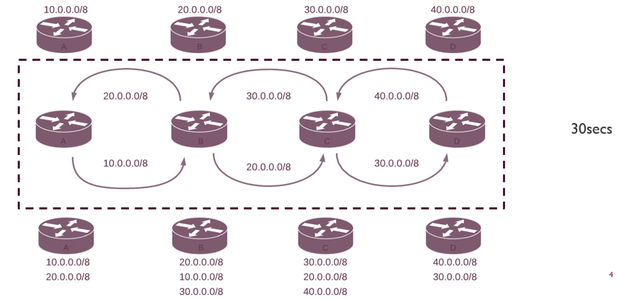

---

## RIP Routing Broadcast 3

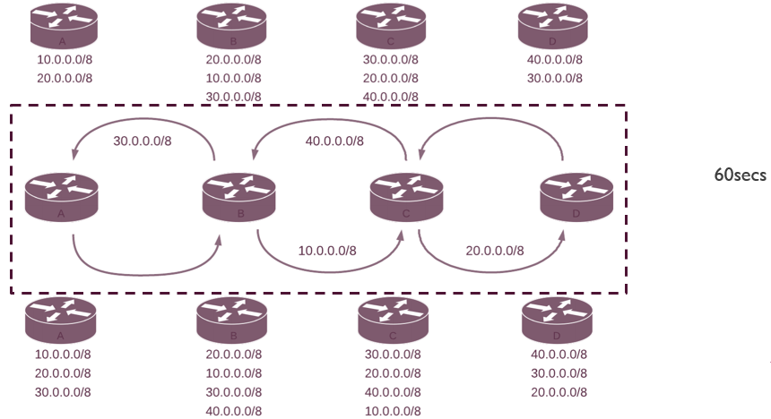

---

## RIP Routing Broadcast 4

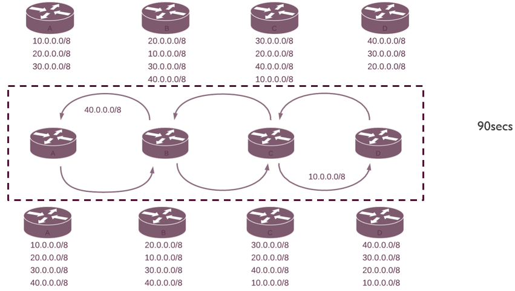

---

## RIP Convergence

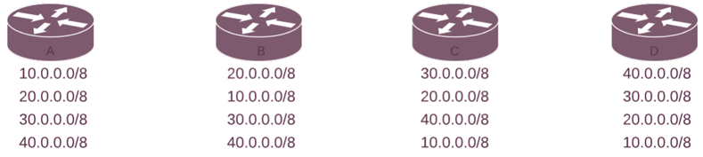

The situation in which all routers know all paths of the network is called convergence. 

- After the convergence, the RIP routing protocol actively monitors all paths. 

- If it detects any change in any path, it updates neighbouring routers about that change in the next broadcast.

---

## IOS Mode Hierarchical Structure 

In Cisco Internetwork Operating System (IOS) you can always get more information and help with a command by putting ? after the command. Think of it as man in Linux, just in the end. For instance, the next command prints all commands that are available in the User mode.

`router> ?`

CLI uses a hierarchical structure for the modes

- User Executive mode (user EXEC)

- Privileged executive mode (privileged EXEC)

- Global configuration mode

- Specific configuration mode

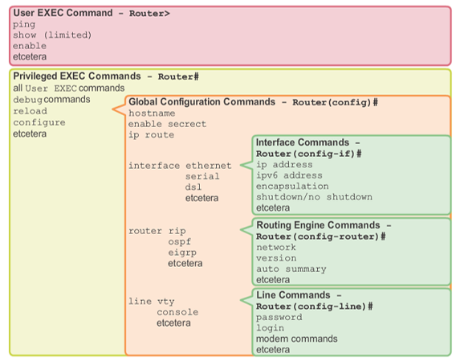

--- 

## IOS Mode Hierarchical Structure 

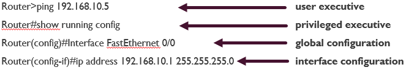

---

## IOS Mode Hierarchical Structure 

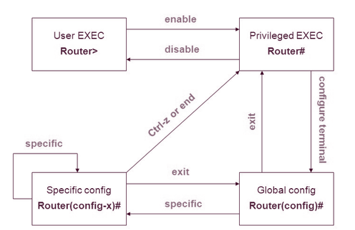

---

## Command Structure

Command is the initial word entered in the command line:

- Commands are not case-sensitive

Following the command is one or more keywords and arguments:

- Keywords describe specific parameters to the command interpreter

- An argument is a value or variable defined by the user

- An argument can be any text string of up to 80 characters

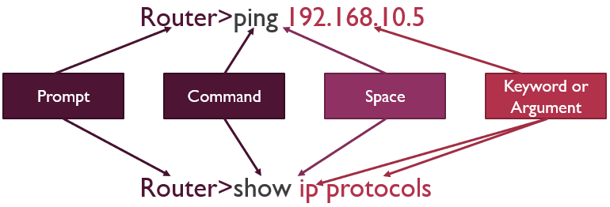

---

## Login Banner Messages

- Provide a method for declaring only authorised personnel should attempt to gain entry into the device

- Banners can be an important part of the legal process in the event that someone is prosecuted for breaking into a device

- Any wording that implies a login is “welcome” or “invited” is not appropriate

- The banner can include scheduled system shutdowns and other useful information that affects all network users

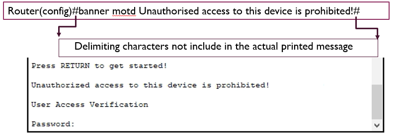

---

## Login Banner Messages PT 2

For multi line text enter the command an press enter

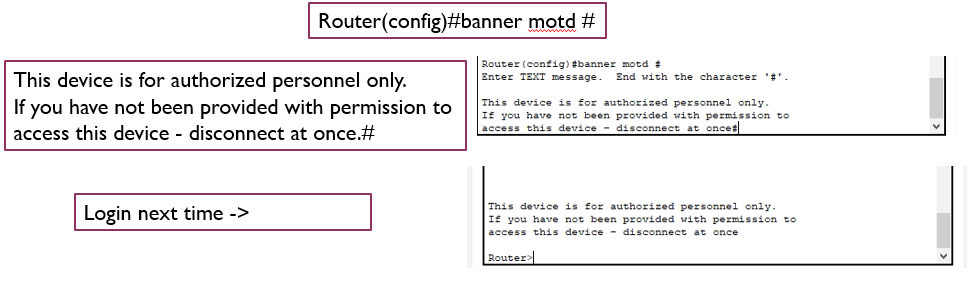

Additional messages can be created for, login and exec -> `#banner login #` or `#banner exec #`

---

## Console passwords

- Limits device access using the console connection
- The console port of a device has special privileges

  - It must be secured with a strong password to prevent unauthorised personnel plugging a cable into the device and gaining access.

- The `Line console 0` command is used to enter the line configuration mode for the console.

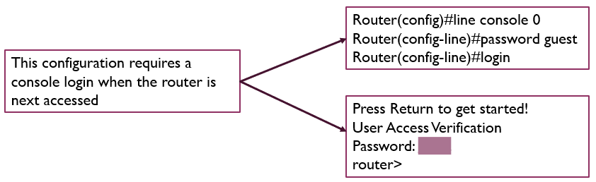

---

## Router commands

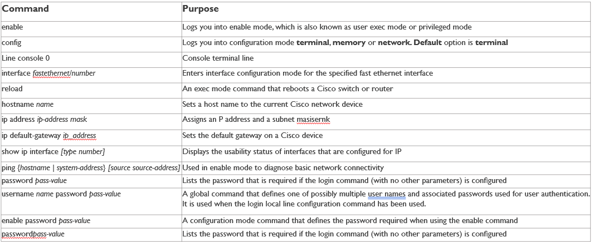

---

## RIP Commands Summary

RIP Routing protocol configuration commands summary

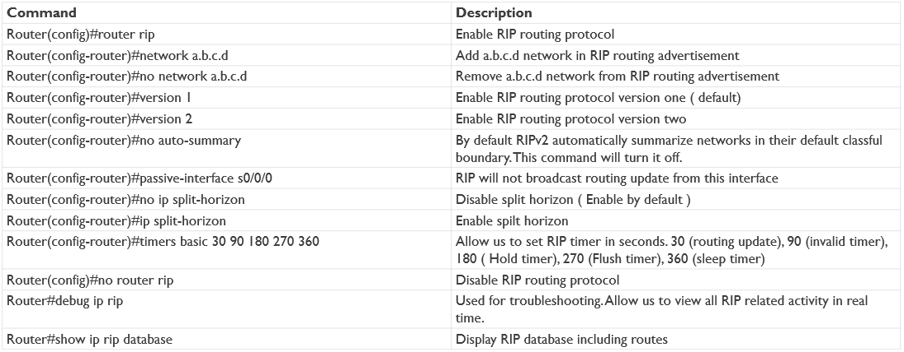
