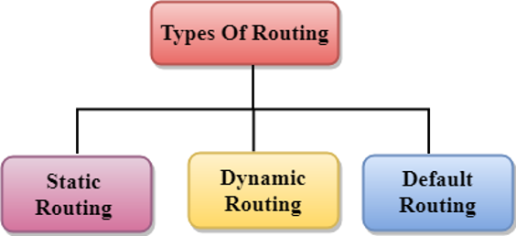
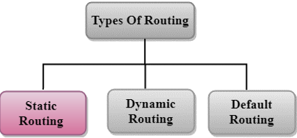
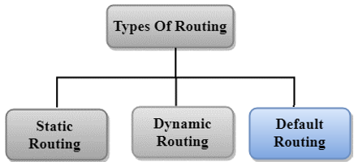
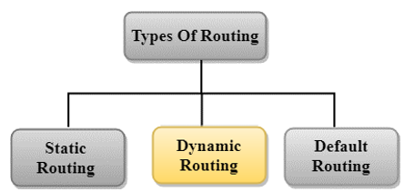
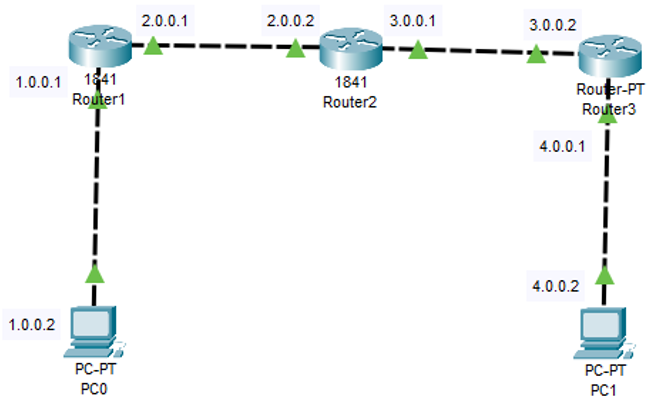

<!-- _footer: "[Download as a PDF](https://github.com/UniOfGreenwich/ELEE1157_Lectures/raw/gh-pages/content//c/Users/dev/Git/UoG/ELEE1157/Lectures/content/RoutingTypes/RoutingTypes.pdf)" -->

# Routing Types

    Module Code: ELEE1157

    Module Name: Network Routing Management

    Lecturer: Seb Blair BEng(H) PGCAP MIET MIHEEM FHEA

---

## Contents

1. Routing​

2. Routing Metrics and Costs PT1​

3. Routing Metrics and Costs PT2​

4. Routing Metrics and Costs PT3​

5. Types of Routing​

6. Types of Routing – Static Routing PT1​

7. Types of Routing – Static Routing PT2​

8. Types of Routing – Default Routing​

9. Types of Routing – Dynamic Routing PT1​

10. Types of Routing – Dynamic Routing PT2​

11. Example of static Routing​

---

## Routing​

- A Router is a process of selecting path along which the data can be transferred from source to the destination. Routing is performed by a special device known as a router.​

- A Router works at the network layer in the **OSI** model and internet layer in **TCP/IP** model​

- A router is a networking device that forwards the packet based on the information available in the packet header and forwarding table.​

- The routing algorithms are used for routing the packets. The routing algorithm is nothing but a software responsible for deciding the optimal path through which packet can be transmitted.​

- The routing protocols use the metric to determine the best path for the packet delivery. The metric is the standard of measurement such as **hop count**, **bandwidth**, **delay**, **current load** on the path, etc. used by the routing algorithm to determine the optimal path to the destination.​

- The routing algorithm initialises and maintains the routing table for the process of path determination.​

​

---

## Routing Metrics and Costs PT1​

​- Routing metrics and costs are used for determining the best route to the destination. The factors used by the protocols to determine the shortest path, these factors are known as a metric.​

​- Metrics are the network variables used to determine the best route to the destination. For some protocols use the static metrics means that their value cannot be changed and for some other routing protocols use the dynamic metrics means that their value can be assigned by the system administrator.​

  - There are give common metric values: **Hop Count**, **Delay**, **Bandwidth**, **Load** and **Reliability​**
  
---​

## Routing Metrics and Costs PT2​

**Hop count​**

- Hop count is defined as a metric that specifies the number of passes through internetworking devices such as a router, a packet must travel in a route to move from source to the destination. If the routing protocol considers the hop as a primary metric value, then the path with the least hop count will be considered as the best path to move from source to the destination.​

**Delay​**

- It is a time taken by the router to process, queue and transmit a datagram to an interface. The protocols use this metric to determine the delay values for all the links along the path end-to-end. The path having the lowest delay value will be considered as the best path.​

**Bandwidth​**

- The capacity of the link is known as a bandwidth of the link. The bandwidth is measured in terms of bits per second. The link that has a higher transfer rate like gigabit is preferred over the link that has the lower capacity like 56 kb. The protocol will determine the bandwidth capacity for all the links along the path, and the overall higher bandwidth will be considered as the best route.​

​---

## Routing Metrics and Costs PT3​

**Load** ​

- Load refers to the degree to which the network resource such as a router or network link is busy. A Load can be calculated in a variety of ways such as CPU utilization, packets processed per second. If the traffic increases, then the load value will also be increased. The load value changes with respect to the change in the traffic.​

**Reliability​**

- Reliability is a metric factor may be composed of a fixed value. It depends on the network links, and its value is measured dynamically. Some networks go down more often than others. After network failure, some network links repaired more easily than other network links. Any reliability factor can be considered for the assignment of reliability ratings, which are generally numeric values assigned by the system administrator.​

---

## Types of Routing​

​

---

## Types of Routing – Static routing pt1

- Static Routing is also known as **Nonadaptive Routing**.

- It is a technique in which the administrator **manually** adds the routes in a routing table.

- A Router can send the packets for the destination along the route defined by the administrator.

- In this technique, routing decisions are not made based on the condition or topology of the networks

---

## Types of Routing – Static Routing PT2

**Advantages**

- No Overhead: It has ho overhead on the CPU usage of the router. Therefore, the cheaper router can be used to obtain static routing.

- Bandwidth: It has not bandwidth usage between the routers.

- Security: It provides security as the system administrator is allowed only to have control over the routing to a particular network.

**Disadvantages**

- For a large network, it becomes a very difficult task to add each route manually to the routing table.

- The system administrator should have a good knowledge of a topology as they have to add each route manually.

---

## Types of Routing – Default routing

- Router is configured to send all the packets to the same hop device, and it doesn't matter whether it belongs to a particular network or not.  

- A Packet is transmitted to the device for which it is configured in default routing.

- Is used when networks deal with the single exit point.

- It is also useful when the bulk of transmission networks have to transmit the data to the same hp device.

- When a specific route is mentioned in the routing table, the router will choose the specific route rather than the default route. The default route is chosen only when a specific route is not mentioned in the routing table.

---

## Types of Routing – Dynamic Routing PT1

- It is also known as Adaptive Routing.

- It is a technique in which a router adds a new route in the routing table for each packet in response to the changes in the condition or topology of the network.

- Dynamic protocols are used to discover the new routes to reach the destination.

- In Dynamic Routing, RIP and OSPF are the protocols used to discover the new routes.

- If any route goes down, then the automatic adjustment will be made to reach the destination.

---

## Types of Routing – Dynamic Routing PT2

**Mandatory features**

- All the routers must have the same dynamic routing protocol in order to exchange the routes.

- If the router discovers any change in the condition or topology, then router broadcast this information to all other routers.

**Advantages**

- It is easier to configure.

- It is more effective in selecting the best route in response to the changes in the condition or topology.

**Disadvantages**

- It is more expensive in terms of CPU and bandwidth usage.

- It is less secure as compared to default and static routing.

---

## Example of Static Routing

`Router(config)# ip route destination_network_# [subnet_mask] IP_address_of_next_hop_ [admin_dist] [permanent]`

**Router 1 Static Route**

`Router(config)#ip route 3.0.0.0 255.0.0.0 2.0.0.2`

`Router(config)#ip route 4.0.0.0 255.0.0.0 2.0.0.2`

**Router 2 Static Route**

`Router(config)#ip route 1.0.0.0 255.0.0.0 2.0.0.1`

`Router(config)#ip route 4.0.0.0 255.0.0.0 3.0.0.2`

**Router 3 Static Route**

`Router(config)#ip route 2.0.0.0 255.0.0.0 3.0.0.1`

`Router(config)#ip route 1.0.0.0 255.0.0.0 3.0.0.1`

