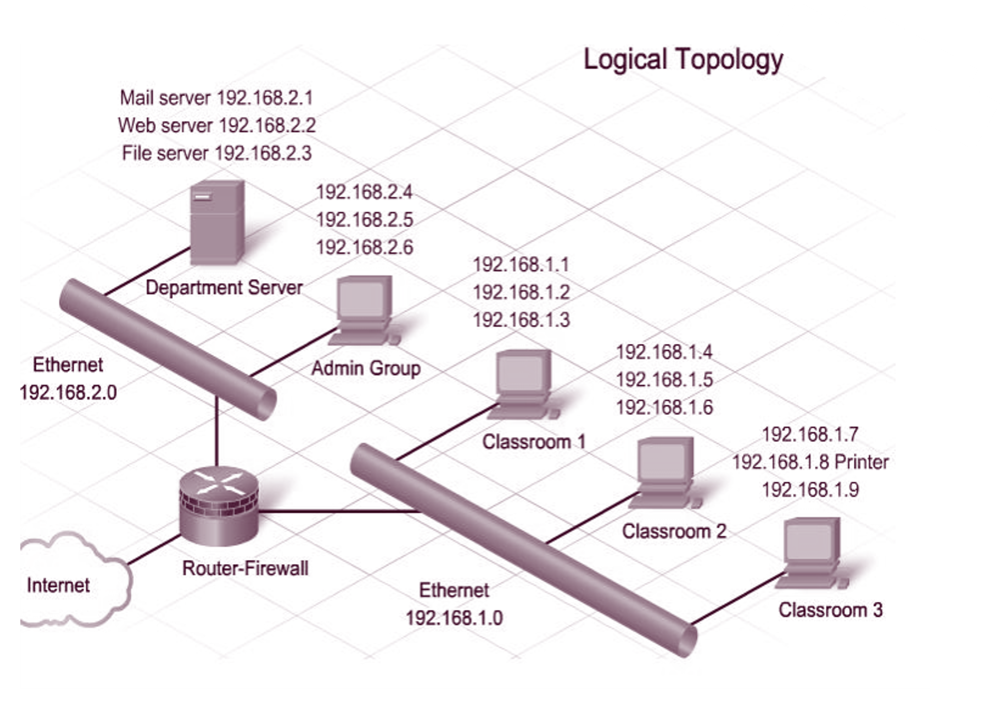
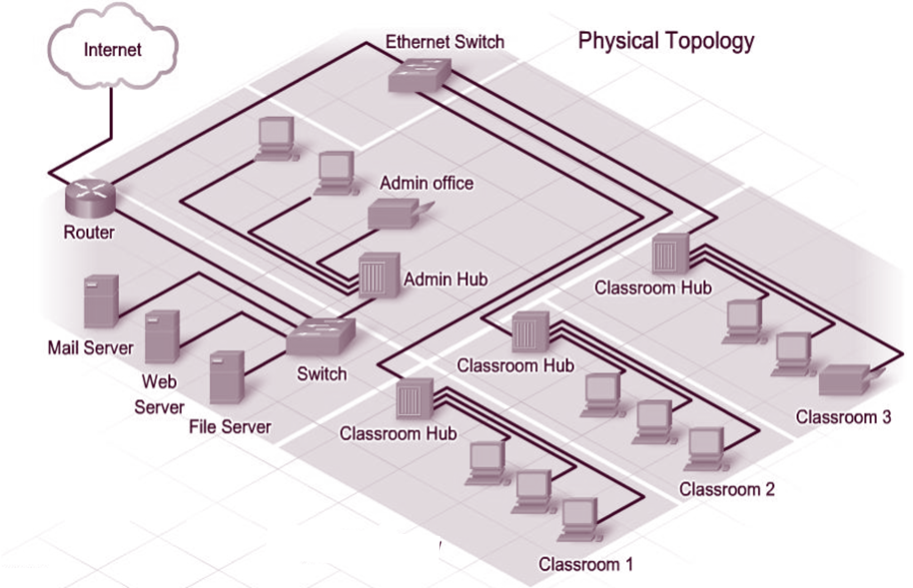
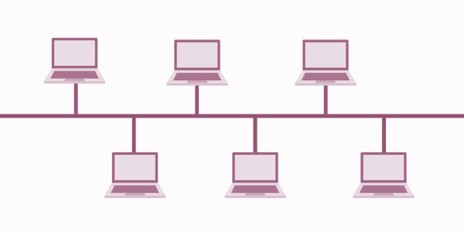
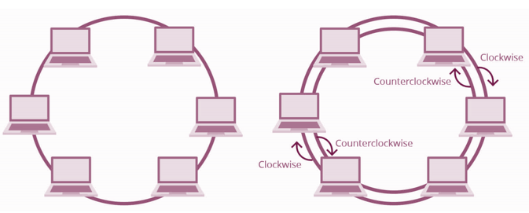
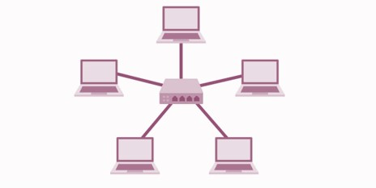
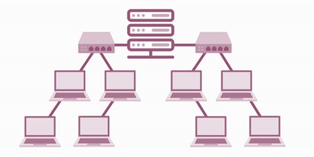
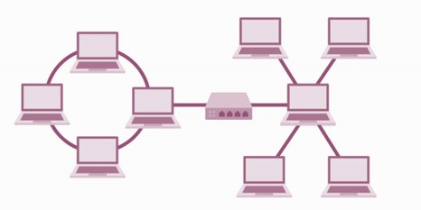

<!--
# Metadata
title: Topologies
author: Seb Blair (CompEng0001)
description: Topologies
keywords: Topologies
lang: en

# Slide styling
theme: uog-theme
_class: lead title
paginate: true
_paginate: false
transition: fade 250ms

style: |
  header em { font-style: normal; view-transition-name: header; }
  header strong { font-weight: inherit; view-transition-name: header2; }
  header:not:has(em) { view-transition-name: header; }
-->

<style scoped>
h1 {
  view-transition-name: header;
  display: flex;
  align-items: center;
  margin: 0 auto;
}
</style>

# Topologies

<div align=center style="font-size:76px; padding-left:300px;padding-right:300px;" >

```
HTTP/1.1 200 OK
Content-Type: application/json
Date: Thu, 10 Jul 2025 08:26:00 GMT
Server: EduAPI/3.0

{
  "code": "ELEE1157",
  "name": "Network Routing Management",
  "credits": 15,
  "module_leader": "Seb Blair BEng(H) PGCAP MIET MIHEEM FHEA"
}

```

</div>

<!-- _footer: "[Download as a PDF](https://github.com/UniOfGreenwich/ELEE1157_Lectures/raw/main/content/Topologies/Topologies.pdf)" -->

---

<style scoped>
h1 { view-transition-name: header2; }
</style>

<!-- header: "_Topologies_" -->

## What is Network Topology​

<br>

- Network topology is the **description** of the arrangement of nodes (e.g. networking switches and routers) and connections in a network. ​

<br>

- Network topologies outline how devices are connected together and how data is transmitted from one node to another.​

<br>

- The configuration, or topology, of a network is key to determining its performance. Network topology is the way a network is arranged, including the **physical** or **logical** description of how links and nodes are set up to relate to each other.​

---

## Logical Network Topology​

<div class="columns-2">
<div style="font-size:26px;padding-top:100px">

- Logical network topology is a higher-level idea of how the network is set up, including which nodes connect to each other and in which ways, as well as how data is transmitted through the network. 

<br>

- Logical network topology includes any virtual and cloud resources.

<br>

- A logical network topology is a conceptual representation of how devices operate at particular layers of abstraction.

</div>
<div>



</div>
</div>

---

## Physical Network Topology

<div class="columns-2" style="padding-top:100px">
<div style="font-size:26px;padding-top:75px">

- The physical network topology refers to the actual connections (wires, cables, etc.) of how the network is arranged. 

<br>

- Setup, maintenance, and provisioning tasks require insight into the physical network.

<br>

- A physical topology details how devices are physically connected

</div>



---

## Types of Network Topology

<div style="font-size:26px;">

- Building a local area network (LAN) topology can be make-or-break for your business, as you want to set up a resilient, secure, and easy-to-maintain topology.

<br>

- A network topology map is a map that allows an administrator to see the physical network layout of connected devices

<br>

- There are many different types of **basic** network topologies that networks are built on today and in the past:

<div class="columns-2" style="padding-top:50px">
<div style="padding-left:300px">

- Bus
<br>
- Ring
<br>
- Star
<br>

</div>
<div style="padding-right:300px">

  - Tree
  <br>
  - Mesh
  <br>
  - Hybrid

</div>
</div>
</div>

---

## Bus Topology

**Bus** topology is a network type where every device is connected to a single cable that runs from one end of the network to the other.   This type of network topology is often referred to as line topology. 

<div class="columns-2">
<div style="font-size:29px;padding-top:75px;" >

**Advantages**
- Simple layout, single cable, cost effective

<br>

**Disadvantages** 
- Single point of failure, cost lot of time to fix as whole cable needs replacing, high network traffic would decrease network performance.

<br>

Half-duplex -> data can only be transmitted one way at a time

</div>
<div style="padding-left:25px;padding-top:175px;">



</div>
</div>

---

## Ring Topology

<div style="font-size:24px">

In networks with **ring** topology, computers are connected to each other in a circular format. Every device in the network will have **two** neighbours and no more or no less. Was used more often in the past than present day.

</div>

<div class="columns-2">
<div style="font-size:29px;padding-top:75px;" >

**Advantages**
- the risk of packet collisions is very low due to the use of **token-based protocols**, which only allow one station to transmit data at a given time, data can move through network nodes at high speeds

<br>

**Disadvantages** 
- failure of one node can take the entire network out of operation, raised scalability concerns (more devices longer to transmit)

<br>

</div>
<div style="padding-left:25px;padding-top:175px;">



</div>
</div>

half-duplex but can also be made full-duplex (Dual Ring Topology)

---

## Star Topology

A star topology is a topology where every node in the network is connected to one central **switch**.  The relationship between these elements is that the central network hub is a **server** and other devices are treated as **clients**

The devices are usually configured in **primary-secondary** relationship.

<div class="columns-2">
<div style="font-size:29px;padding-top:75px;" >

**Advantages**
- can manage the entire network from one location,  can add new computers without having to take the network offline, simple to set up and manage

<br>

**Disadvantages** 
- if the central switch goes down then the entire network will go down, performance of the network is also tied to the central node’s configurations and performance

<br>

</div>
<div style="padding-left:50px;padding-top:125px;">



</div>
</div>

---

## Tree Topology

<div style="font-size:29px">

A tree topology network is a structure that is shaped like a tree with its many **branches**, they have a **root node** that is connected to another node hierarchy, **parent-child**.  Tree topology needs to have **three levels** to the hierarchy to be classified this way, and this form is used withing **WANs**. 

The devices are usually configured in **primary-secondary** relationship.

</div>

<div class="columns-2">
<div style="font-size:29px;padding-top:75px;" >

**Advantages**
- used is to extend bus and star topologies, room for growth, systematically search for issues throughout each branch of the tree. 

<br>

**Disadvantages** 
- If the root node fails then all of its subtrees become partitioned, he more nodes you add, the more difficult it becomes to manage, more cables, more complex

</div>
<div style="padding-left:50px;padding-top:125px;">



</div>
</div>

---

## Mesh Topology

<div style="font-size:27px">

A mesh topology is a **point-to-point** connection where nodes are interconnected. In this form of topology, data is transmitted via two methods: **routing** and **flooding**.

**Routing** is the shortest path, and **flooding** is data is sent to everyone, ergo no routing logic.

**Partial Mesh**, most nodes are interconnected but there are a few that may have extra two or three connected nodes.

**Full Mesh**, every node is connected to every node

Links required per node $N - 1$  & Links for fully connected network  $L_N = \frac{N(N - 1)}{2}$

</div>

<div class="columns-2">
<div style="font-size:27px;padding-top:75px;" >

**Advantages**
- Extremely resistant to failure due to the amount of possible paths, no single point of failure

<br>

**Disadvantages** 
- Requires an immense amount of time to configure, lots of wiring, costly

</div>
<div style="padding-left:50px;padding-top:75px;">


</div>
</div>

---

## Hybrid topology

<div style="font-size:29px">

Composed of two or more different topologies and are most-commonly encountered in larger enterprises. A mixed bag of capabilities and vulnerabilities.

</div>

<div class="columns-2">
<div style="font-size:29px;padding-top:150px;" >

**Advantages**
- Flexible, incorporate multiple typologies, very scalable 

<br>

**Disadvantages** 
- Complex, each sub typology is managed independently of the whole, can be costly to set up, tough job to manage


</div>
<div style="padding-left:50px;padding-top:175px;">



</div>
</div>