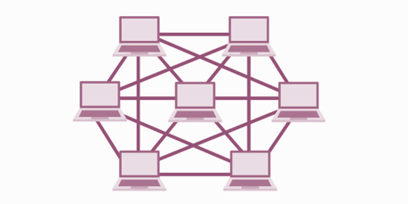

<!-- _footer: "[Download as a PDF](https://github.com/UniOfGreenwich/ELEE1157_Lectures/raw/gh-pages/content//c/Users/dev/Git/UoG/ELEE1157/Lectures/content/Topologies/Topologies.pdf)" -->

# Topologies

    Module Code: ELEE1157

    Module Name: Network Routing Management

    Lecturer: Seb Blair BEng(H) PGCAP MIET MIHEEM FHEA

---

## Contents​

1. Intended Learning Outcomes​

2. Last Time​

3. What is Network Topology​

4. Logical & Physical Network Topologies​

5. Types of Network Topologies​

6. Bus, Ring, Star, Tree, Mesh and Hybrid​
  
---

## Intended Learning Outcomes

1. Define what is meant by Network Typology​

2. Define the difference between Logical and Physical network typologies​

3. Recall 5 network typologies and identify each typology​

---

## Last Time

- Computer networking refers to connected computing devices (such as laptops, desktops, servers, smartphones, and tablets) and an ever-expanding array of IoT devices (such as cameras, door locks, doorbells, refrigerators, audio/visual systems, thermostats, and various sensors) that communicate with one another.​

- Specialised Devices – switches (AP), routers​

- Types of Area Networks -> BAN, CAN, LAN, WAN…

---

## What is Network Topology​

- Network topology is the **description** of the arrangement of nodes (e.g. networking switches and routers) and connections in a network. ​

- Network topologies outline how devices are connected together and how data is transmitted from one node to another.​

- The configuration, or topology, of a network is key to determining its performance. Network topology is the way a network is arranged, including the **physical** or **logical** description of how links and nodes are set up to relate to each other.​

---

## Logical Network Topology​

- Logical network topology is a higher-level idea of how the network is set up, including which nodes connect to each other and in which ways, as well as how data is transmitted through the network. 

- Logical network topology includes any virtual and cloud resources.

- A logical network topology is a conceptual representation of how devices operate at particular layers of abstraction.

---

## Physical Network Topology

- The physical network topology refers to the actual connections (wires, cables, etc.) of how the network is arranged. 

- Setup, maintenance, and provisioning tasks require insight into the physical network.

- A physical topology details how devices are physically connected

---

## Types of Network Topology

- Building a local area network (LAN) topology can be make-or-break for your business, as you want to set up a resilient, secure, and easy-to-maintain topology.

- A network topology map is a map that allows an administrator to see the physical network layout of connected devices

- There are many different types of **basic** network topologies that networks are built on today and in the past:

  - Bus
  - Ring
  - Star

  - Tree
  - Mesh
  - Hybrid

---

## Bus Topology

**Bus** topology is a network type where every device is connected to a single cable that runs from one end of the network to the other.   This type of network topology is often referred to as line topology. 

**Advantages**
- Simple layout, single cable, cost effective

**Disadvantages** 
- Single point of failure, cost lot of time to fix as whole cable needs replacing, high network traffic would decrease network performance.

Half-duplex -> data can only be transmitted one way at a time

---

## Ring Topology

In networks with **ring** topology, computers are connected to each other in a circular format. Every device in the network will have **two** neighbours and no more or no less. Was used more often in the past than present day.

**Advantages**
- the risk of packet collisions is very low due to the use of **token-based protocols**, which only allow one station to transmit data at a given time, data can move through network nodes at high speeds

**Disadvantages** 
- failure of one node can take the entire network out of operation, raised scalability concerns (more devices longer to transmit)

half-duplex but can also be made full-duplex (Dual Ring Topology)

---

## Star Topology

A star topology is a topology where every node in the network is connected to one central **switch**.  The relationship between these elements is that the central network hub is a **server** and other devices are treated as **clients**

The devices are usually configured in **primary-secondary** relationship.

**Advantages**
- can manage the entire network from one location,  can add new computers without having to take the network offline, simple to set up and manage

**Disadvantages** 
- if the central switch goes down then the entire network will go down, performance of the network is also tied to the central node’s configurations and performance

---

## Tree Topology

A tree topology network is a structure that is shaped like a tree with its many **branches**, they have a **root node** that is connected to another node hierarchy, **parent-child**.  Tree topology needs to have **three levels** to the hierarchy to be classified this way, and this form is used withing **WANs**. 

The devices are usually configured in **primary-secondary** relationship.

**Advantages**
- used is to extend bus and star topologies, room for growth, systematically search for issues throughout each branch of the tree. 

**Disadvantages** 
- If the root node fails then all of its subtrees become partitioned, he more nodes you add, the more difficult it becomes to manage, more cables, more complex

---

## Mesh Topology

A mesh topology is a **point-to-point** connection where nodes are interconnected. In this form of topology, data is transmitted via two methods: **routing** and **flooding**.

**Routing** is the shortest path, and **flooding** is data is sent to everyone, ergo no routing logic.

**Partial Mesh**, most nodes are interconnected but there are a few that may have extra two or three connected nodes.

**Full Mesh**, every node is connected to every node

Links required per node $N - 1$  & Links for fully connected network  $L_N = \frac{N(N - 1)}{2}$

**Advantages**
- Extremely resistant to failure due to the amount of possible paths, no single point of failure

**Disadvantages** 
- Requires an immense amount of time to configure, lots of wiring, costly

---

## Hybrid topology

Composed of two or more different topologies and are most-commonly encountered in larger enterprises. A mixed bag of capabilities and vulnerabilities.

**Advantages**
- Flexible, incorporate multiple typologies, very scalable 

**Disadvantages** 
- Complex, each sub typology is managed independently of the whole, can be costly to set up, tough job to manage

