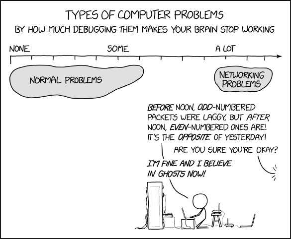

<!--
# Metadata
title: Workshop
author: Seb Blair (CompEng0001)
description: Workshop
keywords: Workshop
lang: en

# Slide styling
theme: uog-theme
_class: lead title
paginate: true
_paginate: false
transition: fade 250ms

style: |
  header em { font-style: normal; view-transition-name: header; }
  header strong { font-weight: inherit; view-transition-name: header2; }
  header:not:has(em) { view-transition-name: header; }
-->

<style scoped>
h1 {
  view-transition-name: header;
  display: flex;
  align-items: center;
  margin: 0 auto;
}
</style>

# Workshop

<div align=center style="font-size:76px;" >

```
HTTP/1.1 200 OK
Content-Type: application/json
Date: Thu, 10 Jul 2025 08:26:00 GMT
Server: EduAPI/3.0

{
  "code": "ELEE1157",
  "name": "Network Routing Management",
  "credits": 15,
  "module_leader": "Seb Blair BEng(H) PGCAP MIET MIHEEM FHEA"
}

```

</div>

<!-- _footer: "[Download as a PDF](https://github.com/UniOfGreenwich/ELEE1157_Lectures/raw/main/content/Workshop/Workshop.pdf)" -->



